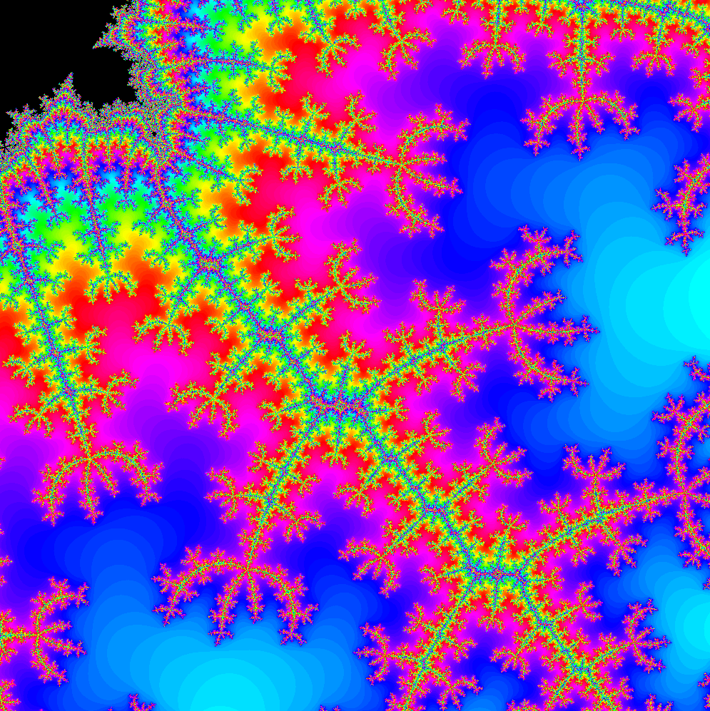

# Mandelbrot




Simple Mandelbrot Set viewer using SDL3 GPU

#### Windows

Install the [Vulkan SDK](https://www.lunarg.com/vulkan-sdk/) for glslc

```bash
git clone https://github.com/jsoulier/mandelbrot --recurse-submodules
cd mandelbrot
mkdir build
cd build
cmake ..
cmake --build . --parallel 8 --config Release
cd bin
./mandelbrot.exe
```

#### Linux

```bash
sudo apt install glslc
```

```bash
git clone https://github.com/jsoulier/mandelbrot --recurse-submodules
cd mandelbrot
mkdir build
cd build
cmake .. -DCMAKE_BUILD_TYPE=Release
cmake --build . --parallel 8
cd bin
./mandelbrot
```

### References

- [Visualizing The Mandelbrot Set Using OpenGL](https://physicspython.wordpress.com/2020/03/04/visualizing-the-mandelbrot-set-using-opengl-part-2/)
