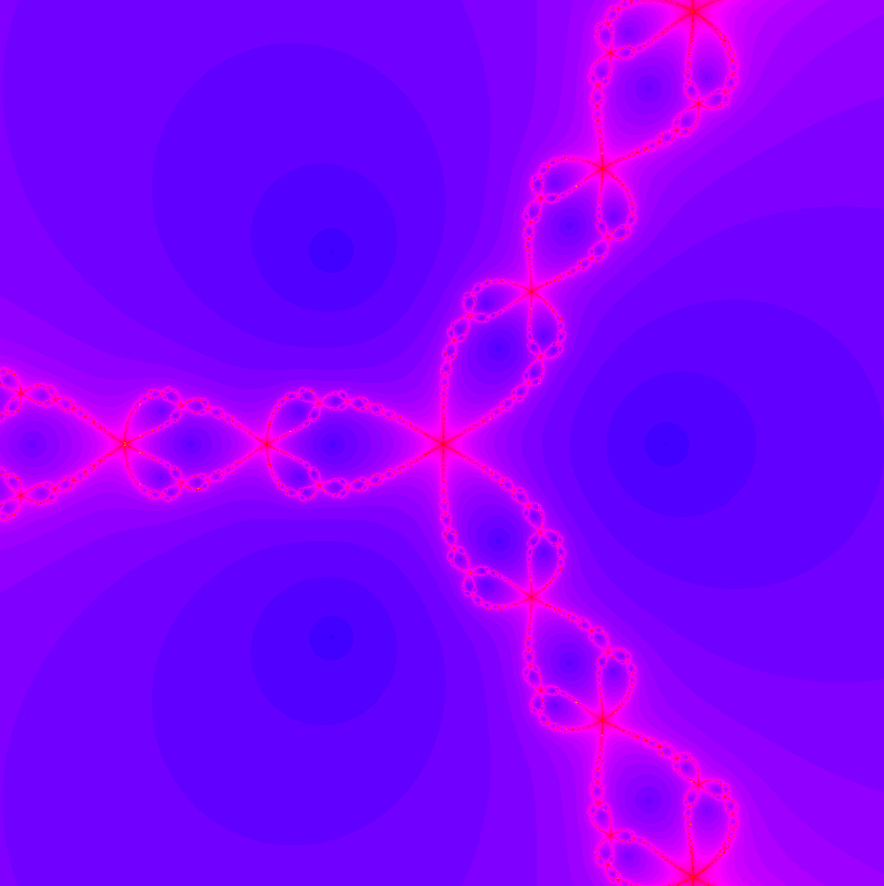

# Fractals




Fractals using SDL3 GPU

### Building

#### Windows

Install the [Vulkan SDK](https://www.lunarg.com/vulkan-sdk/) for glslc

```bash
git clone https://github.com/jsoulier/fractals --recurse-submodules
cd fractals
mkdir build
cd build
cmake ..
cmake --build . --parallel 8 --config Release
cd bin
./fractals.exe
```

#### Linux

```bash
git clone https://github.com/jsoulier/fractals --recurse-submodules
cd fractals
mkdir build
cd build
cmake .. -DCMAKE_BUILD_TYPE=Release
cmake --build . --parallel 8
cd bin
./fractals
```

### References

- [Visualizing The Mandelbrot Set Using OpenGL](https://physicspython.wordpress.com/2020/03/04/visualizing-the-mandelbrot-set-using-opengl-part-2/)